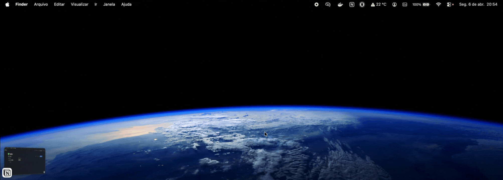

# Personal Assistant

An AI-powered personal assistant that receives messages in natural language, automatically classifies the content type, and organizes everything in Notion — no friction, no switching between apps.



Built from scratch with a real understanding of every technical decision: from API structure to LLM integration and external service communication.

## The Problem

Tasks scattered across notes apps, ideas lost in chat messages, emails to reply forgotten. The lack of a centralized system causes important information to slip through the cracks every day.

## The Solution

Send a message describing anything — a task, an idea, an email you need to reply to — and the system classifies, structures, and automatically saves it to the right Notion database. Before saving, it checks if a similar item already exists to avoid duplicates.

**Example:**

```
Input: "need to study RAG concepts before the interview on Friday"

Output: saved to Tasks with title "Study RAG concepts", priority "medium"
```

```
Input: "study RAG before Friday" (sent again)

Output: similar item already exists — returns link to existing Notion entry
```

## Architecture

```
macOS Menu Bar App (SwiftUI)
       ↓
POST /process (JSON)
       ↓
ChromaDB (check for similar items)
       ↓
  duplicate? → return existing Notion link
       ↓
Groq (classify + structure)
       ↓
Notion API (save) + ChromaDB (store embedding)
```

Four backend components with separated responsibilities:

- **`app/main.py`** — receives and validates requests, configures CORS, orchestrates the flow
- **`app/classifier.py`** — classification logic with Groq and Pydantic validation
- **`app/notion.py`** — Notion API integration
- **`app/memory.py`** — RAG memory layer with ChromaDB and sentence-transformers

Four Swift files for the native macOS frontend:

- **`macos/Sources/PersonalAssistantApp.swift`** — app entry point, delegates UI to `AppDelegate`
- **`macos/Sources/AppDelegate.swift`** — `NSStatusItem` + `NSPopover`, global hotkey registration
- **`macos/Sources/ContentView.swift`** — SwiftUI UI, adapts to system light/dark theme
- **`macos/Sources/APIService.swift`** — HTTP client via `URLSession`

## Technical Decisions

**FastAPI** was chosen for its straightforward endpoint structure, automatic input validation with Pydantic, and auto-generated Swagger documentation.

**Pydantic v2** to validate Groq's output: if the model returns a field with the wrong type or missing entirely, the system raises an error immediately instead of silently propagating invalid data through the pipeline.

**Llama 3 8B** for its speed and quality sufficient for text classification — heavier models would be a waste of cost for this task.

**ChromaDB + sentence-transformers** for the RAG memory layer: instead of exact string matching, the system uses semantic embeddings to detect similar messages regardless of how they're phrased. This prevents duplicate entries in Notion.

**SwiftUI + NSStatusItem/NSPopover** for the frontend: a native macOS menu bar app gives instant access from anywhere on the desktop without occupying Dock space or requiring a browser. The popover uses system semantic colors and materials, automatically adapting to macOS light/dark mode and the user's accent color. The Swift `URLSession` communicates directly with the local FastAPI backend — no CORS issues since native apps don't send `Origin` headers.

## Stack

**Backend**
- Python 3.13
- FastAPI + Uvicorn
- Pydantic v2
- Groq API (`groq`)
- Notion API
- ChromaDB
- sentence-transformers (`all-MiniLM-L6-v2`)
- python-dotenv

**Frontend (macOS)**
- Swift 5.9
- SwiftUI (macOS 13+)
- Swift Package Manager
- `NSStatusItem` + `NSPopover` (native menu bar integration)
- `URLSession` (HTTP client)
- System semantic colors (adapts to light/dark mode)

## Prerequisites

- Python 3.10+
- macOS 13+
- Xcode Command Line Tools (`xcode-select --install`)
- Groq account (free)
- Notion account (free)

## Setup

### 1. Clone the repository

```bash
git clone https://github.com/lucaspanzera1/personal-assistant
cd personal-assistant
```

### 2. Set up the backend

```bash
python3 -m venv venv
source venv/bin/activate
pip install -r requirements.txt
```

Create a `.env` file in the root directory:

```env
GROQ_API_KEY=your_groq_key
NOTION_TOKEN=your_integration_token
NOTION_TASKS_ID=your_tasks_database_id
NOTION_NOTES_ID=your_notes_database_id
NOTION_INBOX_ID=your_inbox_database_id
```

### 3. Set up Groq

1. Go to [Groq Console](https://console.groq.com/)
2. Create an API key
3. Copy the key and add it to `.env`

### 4. Set up Notion

**Create the integration:**
1. Go to [notion.so/my-integrations](https://notion.so/my-integrations)
2. Click **"New integration"**
3. Name it `personal-assistant`
4. Copy the **"Internal Integration Token"** and add it to `.env`

**Create the databases:**
1. Create a Notion page called **"Personal Assistant"**
2. Inside it, create three **Table** databases:
   - `Tasks`
   - `Notes`
   - `Inbox`
3. In each database, add a property called **"Priority"** of type **Select** with options: `high`, `medium`, `low`

**Connect the integration:**
1. Open each database
2. Click **"..."** in the top right corner
3. Go to **"Connections"** and add `personal-assistant`

**Get the database IDs:**
1. Open each database as a full page
2. Copy the link — the ID is the sequence after the last `/` and before `?`
3. Add each ID to `.env`

## Running

```bash
bash macos/run.sh
```

This single command:
1. Kills any running backend and app instances
2. Starts the FastAPI backend with `--reload`
3. Builds the Swift app
4. Launches it as a native macOS menu bar app (🧠 icon in the top bar)

API available at `http://localhost:8000`  
Swagger docs at `http://localhost:8000/docs`

## Usage

Click the 🧠 icon in the macOS menu bar to open the popover, type your message, and press **Return** to send. The result appears with a direct link to Notion. If a similar item already exists, you'll see a warning with a link to the existing entry.

### Keyboard shortcuts

| Shortcut | Action |
|---|---|
| `⌘ + Shift + Space` | Open / close the popover from anywhere |
| `Return` | Send the message |
| `Shift + Return` | New line in the input |

### Via API

`POST /process`

```json
{
  "message": "call the client tomorrow at 10am to close the contract"
}
```

New item response:

```json
{
  "duplicate": false,
  "type": "task",
  "title": "Call client to close contract",
  "priority": "high",
  "notion_url": "https://notion.so/..."
}
```

Duplicate detected response:

```json
{
  "duplicate": true,
  "message": "Similar item already exists.",
  "existing": "call the client tomorrow at 10am to close the contract",
  "notion_url": "https://notion.so/..."
}
```

## Supported Types

| Type | When it's used | Notion Database |
|------|---------------|-----------------|
| `task` | Something that needs to be done, has a clear action | Tasks |
| `note` | Idea, insight, information to save | Notes |
| `inbox` | Email or message that needs a reply | Inbox |

## Project Structure

```
personal-assistant/
├── app/
│   ├── main.py          # FastAPI — endpoints, CORS, flow orchestration
│   ├── classifier.py    # Groq integration and Pydantic validation
│   ├── notion.py        # Notion API integration
│   └── memory.py        # RAG memory layer — ChromaDB + embeddings
├── macos/
│   ├── Sources/
│   │   ├── PersonalAssistantApp.swift  # App entry point
│   │   ├── AppDelegate.swift           # NSStatusItem, NSPopover, global hotkey
│   │   ├── ContentView.swift           # SwiftUI UI — native theme, input, result card
│   │   ├── APIService.swift            # HTTP client (URLSession)
│   │   └── Models.swift                # Codable request/response structs
│   ├── Package.swift    # Swift Package Manager config
│   └── run.sh           # Build + launch script (backend + app)
├── requirements.txt
├── .env.example
└── README.md
```

## Roadmap

- WhatsApp integration via Evolution API
- Date and deadline support for tasks
- Message history log
- Production deploy (Railway)
